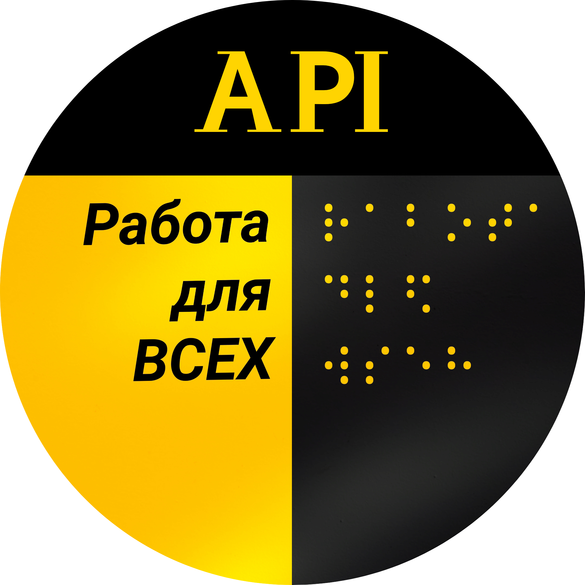

# API "Работа для всех"



**"Работа для всех"** — это открытый REST API для поиска вакансий в России, адаптированных для людей с инвалидностью. Проект агрегирует данные из открытых API портала [Работа России](https://trudvsem.ru/) и сайта [hh.ru](https://hh.ru/), предоставляя единую точку доступа к вакансиям.

Проект находится в активной разработке. Познакомиться с работой API можно в Telegram-боте: [Работа для всех](https://t.me/work_for_all_people_bot).

## 🚀 Основные возможности

- Поиск вакансий по населенному пункту.
- Регистрация и аутентификация пользователей (JWT).
- Добавление вакансий в избранное и управление ими.
- Получение актуального списка регионов и федеральных округов РФ.
- Просмотр детальной информации о конкретной вакансии.

## 🛠️ Технологии и архитектура

- **Бэкенд**: Python, FastAPI
- **Веб-сервер**: Uvicorn / Hypercorn
- **База данных**: PostgreSQL
- **ORM**: SQLAlchemy с Alembic для управления миграциями
- **Аутентификация**: JWT (JSON Web Tokens)
- **Контейнеризация**: Docker, Docker Compose
- **Линтинг и форматирование**: `ruff`

Архитектура представляет собой REST API с версионированием (`/api/v1/`).

## ⚙️ Запуск и разработка

### 1. Переменные окружения

Перед запуском необходимо настроить переменные окружения. Создайте файл `.env` в корне проекта на основе файла [.env.example](.env.example).

Основные переменные:
- `POSTGRES_HOST`, `POSTGRES_USER`, `POSTGRES_PASSWORD`, `POSTGRES_DB`: Настройки для подключения к базе данных PostgreSQL.
- `ACCESS_TOKEN_HH`: Токен доступа для API hh.ru.
- `BASE_ALGORITM`: Секретный ключ для хеширования.
- `EMAIL_...`: Настройки для отправки почты (если требуется).

### 2. Запуск через Docker (рекомендуемый способ)

1.  **Сборка и запуск контейнеров:**
    ```bash
    docker-compose up --build
    ```
    Эта команда поднимет сервисы `db` (PostgreSQL), `api_service` (FastAPI) и `nginx`. При первом запуске API автоматически загружает в базу данных справочники регионов и федеральных округов.

2.  **Остановка контейнеров:**
    ```bash
    docker-compose down
    ```
    API будет доступен по адресу `http://localhost:90` (или по IP вашего сервера).

### 3. Локальная разработка (без Docker)

1.  **Установка зависимостей:**
    ```bash
    pip install -r requirements.txt
    ```

2.  **Запуск сервера:**
    Для локального запуска используется `hypercorn` или `uvicorn`.
    ```bash
    hypercorn app.main:app --reload
    ```
    Сервер будет доступен по адресу `http://127.0.0.1:8000`.

### 4. Работа с базой данных (Alembic)

- **Применение миграций:**
  ```bash
  alembic upgrade head
  ```

- **Создание новой миграции** (после внесения изменений в модели `app/db/models/`):
  ```bash
  alembic revision --autogenerate -m "Краткое описание изменений"
  ```

## ✅ Линтинг

- **Проверка кода с помощью `ruff`:**
  ```bash
  ruff check .
  ```

## 🤖 Для разработчиков с Gemini CLI

Этот репозиторий содержит файл [GEMINI.md](GEMINI.md), который предоставляет расширенный контекст о проекте для Large Language Models. Если вы используете Gemini CLI, вы можете подгрузить этот файл для более эффективной работы с кодовой базой.

## 📂 Структура проекта

```
├── app/                  # Основной исходный код
│   ├── api/v1/           # Эндпоинты API
│   ├── core/             # Настройки и конфигурация
│   ├── db/               # Модели, сессия, миграции
│   ├── repositories/     # Слой доступа к данным
│   ├── services/         # Слой бизнес-логики
│   └── ...
├── nginx/                # Конфигурация Nginx
├── .env.example          # Пример файла с переменными окружения
├── alembic.ini           # Конфигурация Alembic
├── docker-compose.yml    # Определение сервисов Docker
├── Dockerfile            # Инструкции по сборке Docker-образа
├── entrypoint.sh         # Скрипт запуска для контейнера
├── requirements.txt      # Зависимости Python
└── README.md             # Этот файл
```

