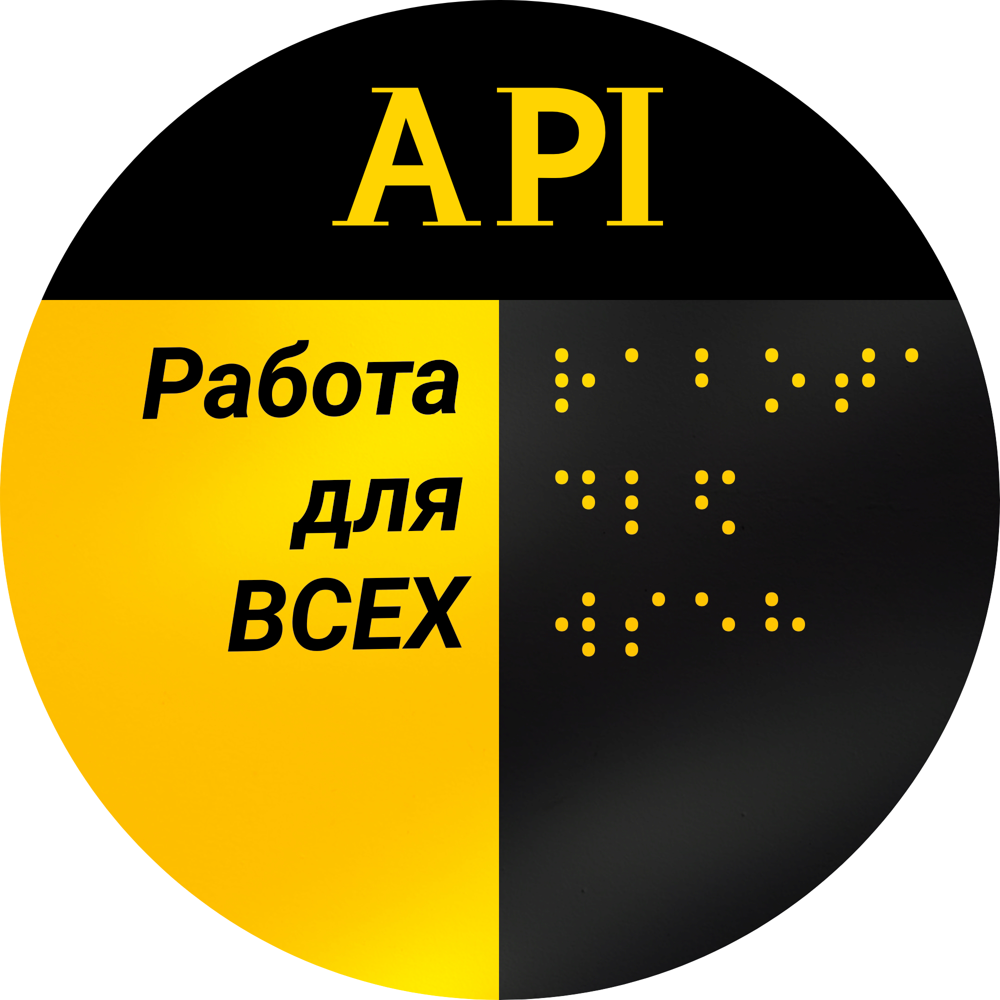

<div align="center">



# Работа для всех — API

**Открытый REST API агрегации вакансий для людей с инвалидностью**

[](https://www.python.org/)
[](https://fastapi.tiangolo.com/)
[](https://www.postgresql.org/)
[](https://docs.docker.com/)

</div>

---

## О проекте

**«Работа для всех»** — REST API для поиска вакансий в России, ориентированных на людей с инвалидностью. Сервис агрегирует данные из двух официальных источников — [Работа России](https://trudvsem.ru/) и [hh.ru](https://hh.ru/) — и предоставляет единый унифицированный доступ к ним.

REST API для поиска вакансий: агрегирует данные из двух источников и предоставляет единый унифицированный интерфейс для клиентских приложений.

---

## Возможности

- **Агрегация из двух источников** — одновременный запрос к Работа России и hh.ru, объединение в единый формат ответа
- **Поиск по населённому пункту** — с фильтрацией по источнику, ключевым словам и пагинацией
- **Избранное** — добавление вакансий в список, управление, актуализация через внешнее API с TTL-кэшем
- **Детальный просмотр** — получение полной информации по вакансии из кэша или внешнего API
- **Справочники** — регионы и федеральные округа РФ
- **AI-ассистент «Вера»** — персонализированные сопроводительные письма и рекомендации по резюме под конкретную вакансию
- **Управление API-ключами** — выдача, деактивация, ротация через master-key
- **Административная панель** — sqladmin для управления данными через веб-интерфейс

---

## Технологии

| Слой | Технология |
|---|---|
| **Язык** | Python 3.12 |
| **Веб-фреймворк** | FastAPI + Pydantic v2 |
| **ASGI-сервер** | Hypercorn / Uvicorn |
| **База данных** | PostgreSQL 16 |
| **ORM / миграции** | SQLAlchemy 2.0 (async) + Alembic |
| **HTTP-клиент** | aiohttp |
| **Административная панель** | sqladmin |
| **Контейнеризация** | Docker + Docker Compose |
| **Reverse proxy** | Nginx |
| **AI** | Yandex Foundation Models (OpenAI-совместимый API) |
| **Линтинг** | ruff |

---

## Архитектура

```
Endpoint  (FastAPI Router)
  └── Service  (бизнес-логика)
        ├── Repository  (доступ к данным, SQLAlchemy async)
        │     └── Database  (PostgreSQL)
        └── External API Client  (aiohttp → hh.ru / trudvsem.ru / LLM)
```

Все публичные эндпоинты версионированы: `/api/v1/`.
Аутентификация — через заголовок `X-Api-Key`.

---

## Быстрый старт

### Требования

- Docker и Docker Compose
- Файл `.env` (см. раздел «Переменные окружения»)

### Запуск

```bash
# 1. Клонируйте репозиторий
git clone <repo-url>
cd api_work_for_everyone

# 2. Создайте .env на основе примера
cp .env.example .env
# Заполните все обязательные переменные

# 3. Запустите сервисы
docker-compose up --build
```

> При первом запуске API автоматически загружает справочники регионов и федеральных округов РФ.

| Сервис | Адрес |
|---|---|
| API | `http://localhost:90` |
| Swagger UI | `http://localhost:90/docs` |
| Административная панель | `http://localhost:90/admin` |

```bash
# Остановка
docker-compose down
```

---

## Переменные окружения

Создайте файл `.env` на основе [`.env.example`](.env.example).

| Переменная | Обязательная | Описание |
|---|:---:|---|
| `POSTGRES_HOST` | ✅ | Хост PostgreSQL (`db` для Docker) |
| `POSTGRES_USER` | ✅ | Пользователь БД |
| `POSTGRES_PASSWORD` | ✅ | Пароль БД |
| `POSTGRES_DB` | ✅ | Имя базы данных |
| `ACCESS_TOKEN_HH` | ✅ | OAuth-токен для API hh.ru |
| `MASTER_API_KEY` | ✅ | Мастер-ключ для управления API-ключами |
| `SECRET_KEY` | ✅ | Секрет сессий административной панели (≥ 32 символа) |
| `ADMIN_LOGIN` | ✅ | Логин для входа в `/admin` |
| `ADMIN_PASSWORD` | ✅ | Пароль для входа в `/admin` |
| `LLM_API_KEY` | ☑️ | API-ключ LLM-провайдера (для AI-ассистента) |
| `LLM_API_URL` | ☑️ | Базовый URL API LLM-провайдера |
| `LLM_MODEL` | ☑️ | Название используемой LLM-модели |
| `LOGGING_CONFIG_PATH` | — | Путь к конфигурации логирования (`logging.ini`) |

> ☑️ — обязательно при использовании AI-ассистента «Вера»

---

## API — обзор эндпоинтов

### Вакансии

| Метод | Путь | Описание |
|---|---|---|
| `POST` | `/api/v1/vacancies/search` | Поиск и сохранение вакансий по населённому пункту |
| `GET` | `/api/v1/vacancies/list` | Список вакансий с фильтрами и пагинацией |
| `GET` | `/api/v1/vacancies/{vacancy_id}` | Детальная информация о вакансии |

**Параметры фильтрации `GET /list`:** `location`, `page`, `page_size`, `keyword`, `source`, `user_id`

### Избранное

| Метод | Путь | Описание |
|---|---|---|
| `POST` | `/api/v1/favorites/add-vacancy` | Добавить вакансию в избранное |
| `POST` | `/api/v1/favorites/delete-vacancy` | Удалить вакансию из избранного |
| `GET` | `/api/v1/favorites/list` | Список избранных вакансий с пагинацией |
| `GET` | `/api/v1/favorites/{vacancy_id}` | Детальная информация об избранной вакансии |

### Справочники

| Метод | Путь | Описание |
|---|---|---|
| `GET` | `/api/v1/regions/` | Список регионов РФ |
| `GET` | `/api/v1/federal-districts/` | Список федеральных округов РФ |

### AI-ассистент «Вера»

Работает только с вакансиями из **избранного**. Требует `X-Api-Key`.

| Метод | Путь | Описание |
|---|---|---|
| `POST` | `/api/v1/assistant/cover-letter/{vacancy_id}` | Шаблон сопроводительного письма |
| `POST` | `/api/v1/assistant/cover-letter/questionnaire/{vacancy_id}` | Анкета для персонализации письма |
| `POST` | `/api/v1/assistant/cover-letter/by-questionnaire/{vacancy_id}` | Письмо по ответам анкеты |
| `POST` | `/api/v1/assistant/resume-tips/{vacancy_id}` | Рекомендации по резюме |
| `POST` | `/api/v1/assistant/resume-tips/questionnaire/{vacancy_id}` | Анкета для персонализации рекомендаций |
| `POST` | `/api/v1/assistant/resume-tips/by-questionnaire/{vacancy_id}` | Рекомендации по ответам анкеты |

### Управление API-ключами

Требует `X-Master-Key`.

| Метод | Путь | Описание |
|---|---|---|
| `POST` | `/api/v1/api-keys/create` | Создать новый API-ключ |
| `POST` | `/api/v1/api-keys/deactivate` | Деактивировать API-ключ |

> Полная интерактивная документация: [`/docs`](http://localhost:90/docs)

---

## Аутентификация

**Публичные эндпоинты** — заголовок `X-Api-Key`:
```
X-Api-Key: your_api_key
```

**Административные эндпоинты** — заголовок `X-Master-Key`:
```
X-Master-Key: your_master_api_key
```

<details>
<summary>Создание API-ключа</summary>

```http
POST /api/v1/api-keys/create
X-Master-Key: your_master_api_key
Content-Type: application/json

{
  "issued_for": "telegram_bot",
  "owner_email": "your@email.com",
  "comment": "Необязательный комментарий"
}
```

**Ответ `201 Created`:**
```json
{
  "api_key": "generated_api_key_string",
  "api_key_prefix": "key_prefix_",
  "issued_for": "telegram_bot",
  "owner_email": "your@email.com",
  "is_active": true,
  "created_at": "2026-03-22T12:00:00Z",
  "expires_at": null
}
```
</details>

<details>
<summary>Деактивация API-ключа</summary>

```http
POST /api/v1/api-keys/deactivate
X-Master-Key: your_master_api_key
Content-Type: application/json

{
  "api_key_prefix": "key_prefix_"
}
```

**Ответ `200 OK`:**
```json
{
  "api_key_prefix": "key_prefix_",
  "is_active": false
}
```
</details>

---

## AI-ассистент «Вера»

«Вера» помогает соискателям подготовить персонализированные материалы для трудоустройства на основе конкретной вакансии из избранного.

**Типичный сценарий:**

```
1. POST /api/v1/favorites/add-vacancy
   → добавить вакансию в избранное

2. POST /api/v1/assistant/cover-letter/questionnaire/{vacancy_id}
   → получить список вопросов для персонализации

3. POST /api/v1/assistant/cover-letter/by-questionnaire/{vacancy_id}
   → получить персонализированное письмо
```

**Тело запроса для `by-questionnaire`:**
```json
{
  "user_id": "user_123",
  "answers": [
    {"question": "Ваш опыт работы?", "answer": "5 лет в разработке на Python"},
    {"question": "Почему эта вакансия?", "answer": "Хочу развиваться в AI-направлении"}
  ]
}
```

---

## Структура проекта

```
.
├── app/
│   ├── admin/                    # sqladmin — административная панель
│   ├── api/v1/endpoints/         # FastAPI-роутеры: vacancies, favorites,
│   │                             #   regions, assistant, api_keys
│   ├── clients/                  # HTTP-клиенты: hh.ru, trudvsem.ru, LLM
│   ├── core/                     # Настройки приложения (Pydantic Settings)
│   ├── db/
│   │   ├── alembic/versions/     # Миграции Alembic
│   │   └── models/               # SQLAlchemy-модели
│   ├── dependencies/             # FastAPI Depends: БД, клиенты, сервисы, API-ключи
│   ├── exceptions/               # Иерархия кастомных исключений
│   ├── repositories/             # Слой доступа к данным (CRUD)
│   ├── schemas/                  # Pydantic-схемы запросов и ответов
│   ├── services/                 # Бизнес-логика
│   │   └── prompts/              # Шаблоны промптов для AI-ассистента
│   ├── static/                   # Статические файлы
│   ├── templates/                # Jinja2-шаблоны
│   └── utils/                    # Вспомогательные утилиты
├── nginx/                        # Конфигурация Nginx
├── .env.example                  # Шаблон переменных окружения
├── alembic.ini                   # Конфигурация Alembic
├── docker-compose.yml            # Описание сервисов Docker
├── Dockerfile                    # Сборка Docker-образа
├── entrypoint.sh                 # Точка входа контейнера
├── requirements.txt              # Python-зависимости
├── PROJECT_KNOWLEDGE.md          # Подробная документация для AI-агентов
└── README.md                     # Этот файл
```

---

## Разработка

### Локальный запуск (без Docker)

```bash
# Установка зависимостей
pip install -r requirements.txt

# Запуск сервера
hypercorn app.main:app --reload
# → http://127.0.0.1:8000
```

### Миграции базы данных

```bash
# Применить все миграции
alembic upgrade head

# Создать новую миграцию (после изменения моделей в app/db/models/)
alembic revision --autogenerate -m "Описание изменений"
```

### Линтинг

```bash
ruff check .
```

---

## Документация

| Документ | Содержание |
|---|---|
| [`/docs`](http://localhost:90/docs) | Интерактивная документация API (Swagger UI) |
| [`PROJECT_KNOWLEDGE.md`](PROJECT_KNOWLEDGE.md) | Архитектура, бизнес-логика, модели БД, соглашения по коду |
| [`DESIGN_GUIDE.md`](DESIGN_GUIDE.md) | Гайдлайн по визуальному стилю проекта |

---

